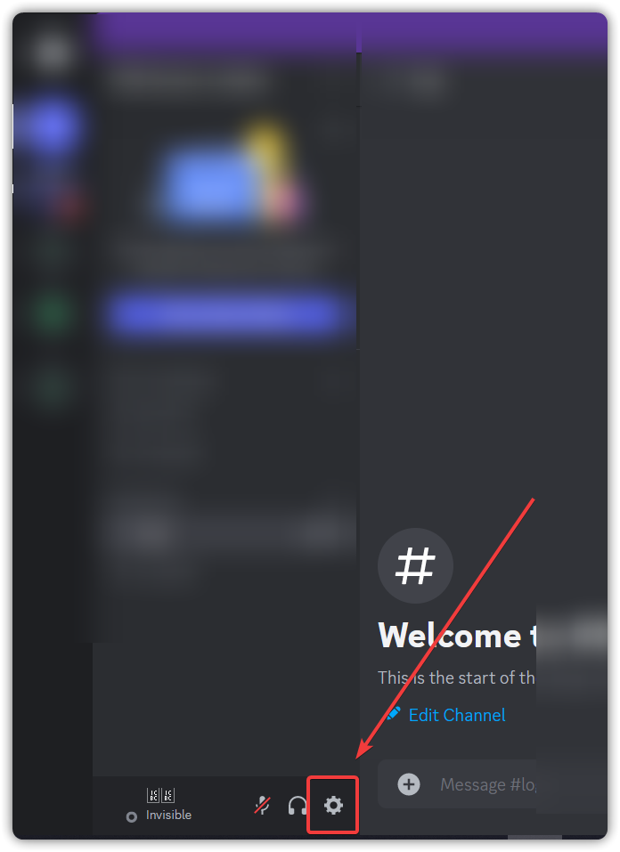
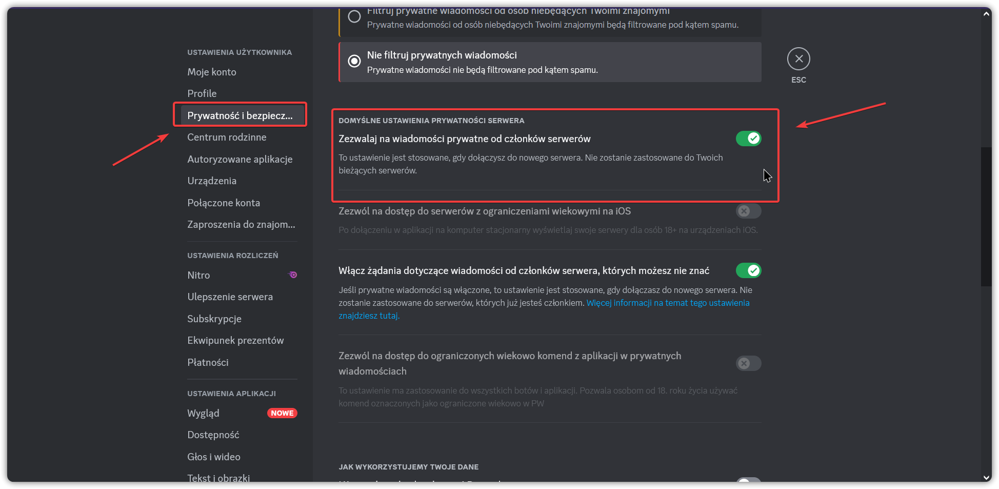
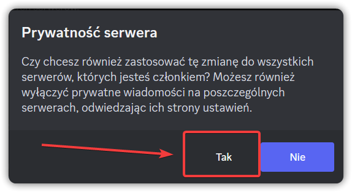
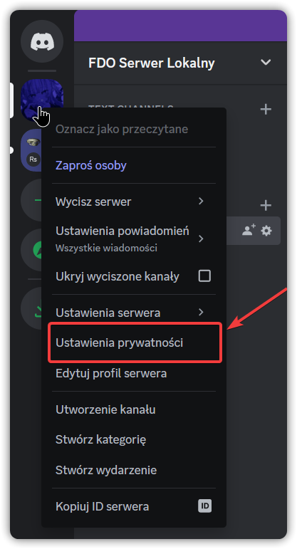
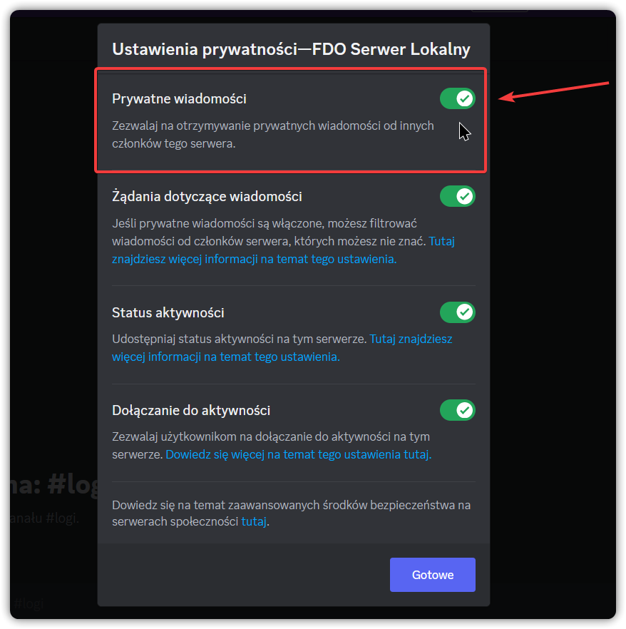
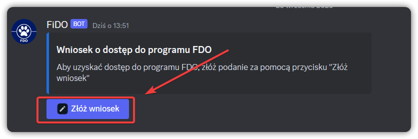
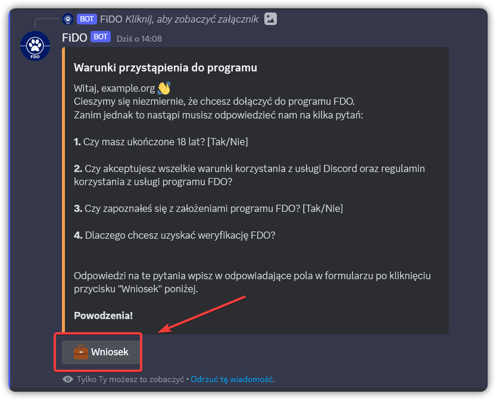
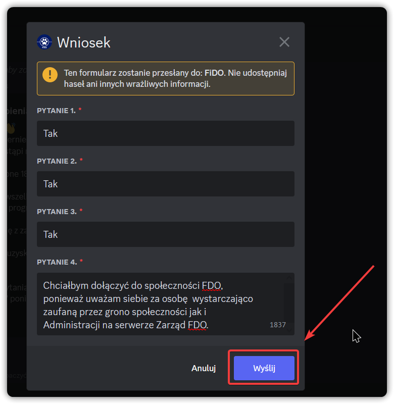
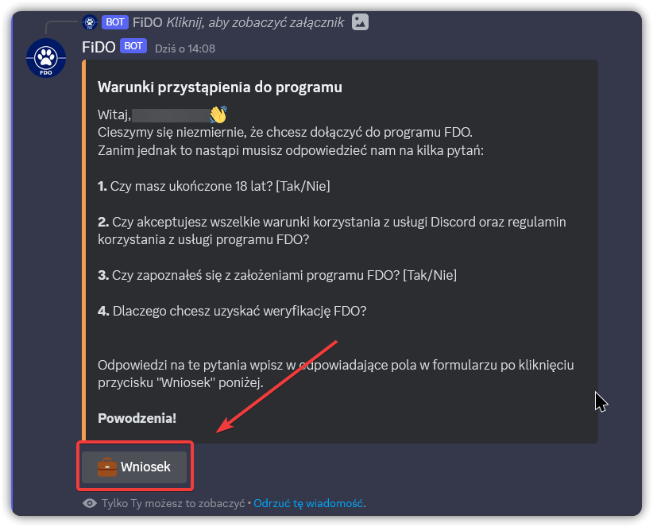
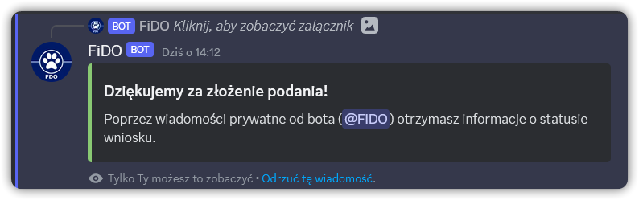

# Futrzasty Identyfikator Dowodów Osobistych

Witaj 👋

W tym miejscu znajdziesz dokładne instrukcje używania aplikacji FiDO. 

## Czym jest FiDO?

Identyfikator FDO jest to paszport pozwalający wybranym użytkownikom na przejście weryfikacji bez potrzeby pisania odpowiedzi na pytania weryfikacyjne.

## Uzyskiwanie dostępu

Warunkiem uzyskania ww. jest złożenie wniosku, który musi zostać rozpatrzony przez administracje serwera gdzie wniosek jest składany a także poprzez wybrany zarząd FDO. Wnioskodawca musi odznaczać się powszechnym zaufaniem wśród administracji serwerów członkowskich.

## Składanie wniosku

Aby złożyć wniosek, potrzebujemy na początku odblokować wiadomości prywatne z serwerów na których znajduje się bot FDO.
### Dlaczego?
Ponieważ to w wiadomości prywatnej, otrzymasz informacje o przyjęciu bądź odrzuceniu wniosku przez Administrację serwera gdzie wniosek jest składany, bądź przez Zarząd FDO.

## Odblokowanie wiadomości prywatnych
Wiadomości prywatne mogą być zablokowane na 2 płaszczyznach: 1) z poziomu Użytkownika 2) na płaszczyźnie serwera.

### 1) Poziom Użytkownika
#### Wejdź w Ustawienia Konta:

#### W sekcji "Prywatność i Bezpieczeństwo" upewnij się, że zaznaczona opcja jest włączona (na zielono):

#### Jeżeli ta opcja była wyłączona, to przy włączaniu pojawi się następujący monit:

#### Wybieramy "Tak"i przechodzimy do sprawdzenia drugiej płaszczyzny.

### 2) Poziom Serwera

#### Kliknij prawym przyciskiem myszy (PPM) na ikonkę serwera gdzie chcesz złożyć wniosek i wybierz "Ustawienia prywatności":

#### Upewnij się, że zaznaczona opcja jest włączona.

#### Jeżeli wszystko zostało sprawdzone to jesteśmy gotowi, do złożenia wniosku :)

## Składanie wniosku

### Zapoznaj się z informacjami na serwerze, gdzie znajduje się kanał od składania wniosków. [Każdy serwer może mieć to w innym miejscu].

#### Kiedy już znaleziono kanał od składania wniosków, kliknij przycisk "Złóż Wniosek":

#### Zapoznaj się z informacjami wyświetlonymi w odpowiedzi i kiedy uznasz to za stosowne kliknij przycisk "Wniosek":

#### W wyświetlonym formularzu udziel odpowiedzi na pytania, możesz cofnąć się aby podejrzeć ponownie pytania bez utraty wprowadzonych informacji:

#### Kiedy udzielisz odpowiedzi na pytania, kliknij przycisk "Wyślij":

#### Prawidłowe złożenie wniosku zostanie potwierdzone taką odpowiedzią:

### Gotowe! W wiadomości prywatnej otrzymasz informacje o statusie twojego wniosku a także jego akceptacji.

## Pytania?

Możesz skontaktować się poprzez Administrację lub w wiadomości prywatnej do `@a3mo` lub jednego z członków zarządu FDO.

##
`Created with passion by Rawiros & An3mo from A3 Team ~ 2023`